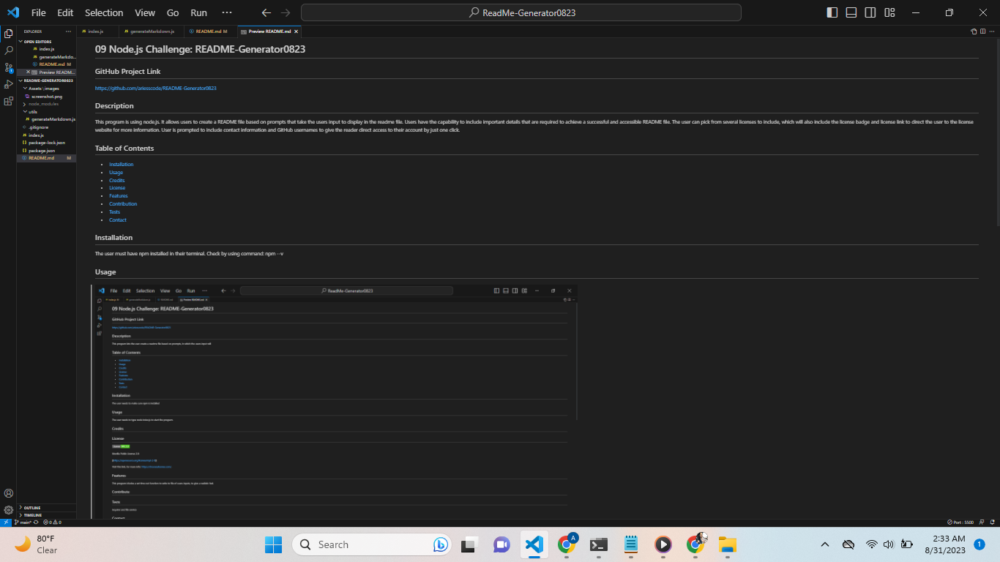

# 09 Node.js Challenge: README-Generator0823

## GitHub Project Link
  https://github.com/ariesscode/README-Generator0823

## Description
This program is using node.js. It allows users to create a README file based on prompts that take the users input to display in the readme file. Users have the capability to include important details that are required to achieve a successful and accessible README file. The user can pick from several licenses to include, which will also include the license badge and license link to direct the user to the license website for more information. User is prompted to include contact information and GitHub usernames to give the reader direct access to their account by just one click.

## Table of Contents 

- [Installation](#installation)
- [Usage](#usage)
- [Credits](#credits)
- [License](#license)
- [Features](#features)
- [Contribution](#contribute)
- [Tests](#tests)
- [Contact](#contact)

## Installation
The user must have npm installed in their terminal. Check by using command: npm --v

## Usage

## Credits

## License

    
  The MIT License: 

  [(https://opensource.org/licenses/MIT)]

    

Visit this link, for more info: [https://choosealicense.com/](https://choosealicense.com/).

## Features

## Contribute

## Tests

## Contact
You can email me at:
abigailtop95@yahoo.com

Visit my GitHub account:
https://github.com/ariesscode

